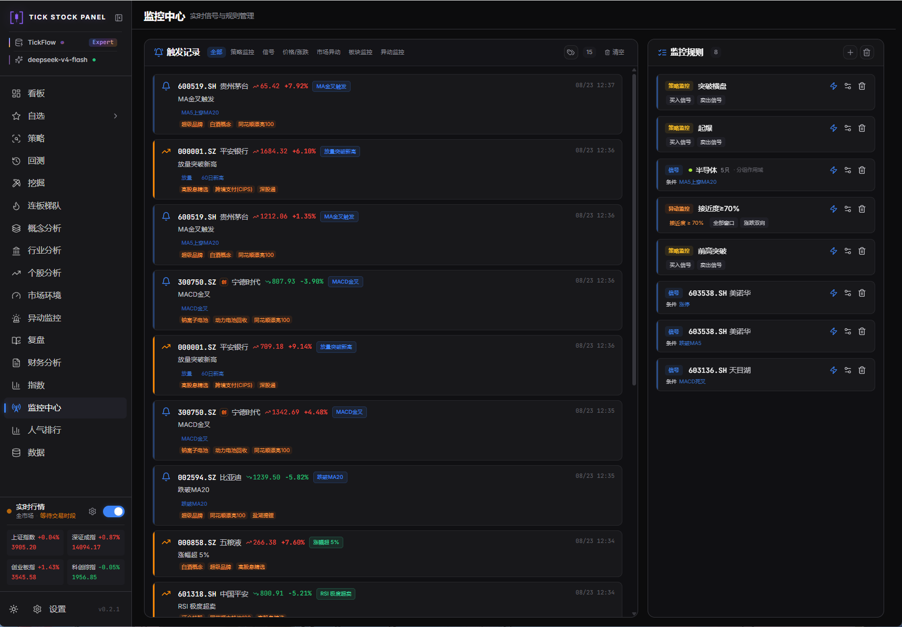
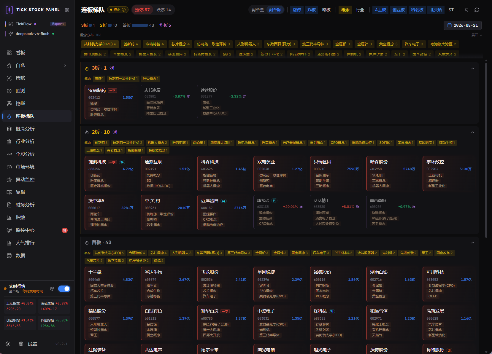
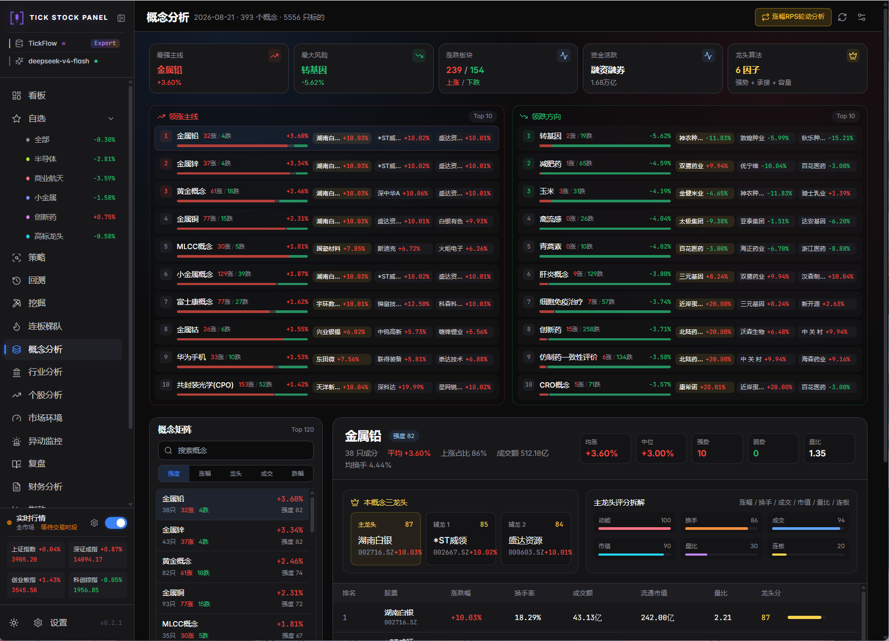
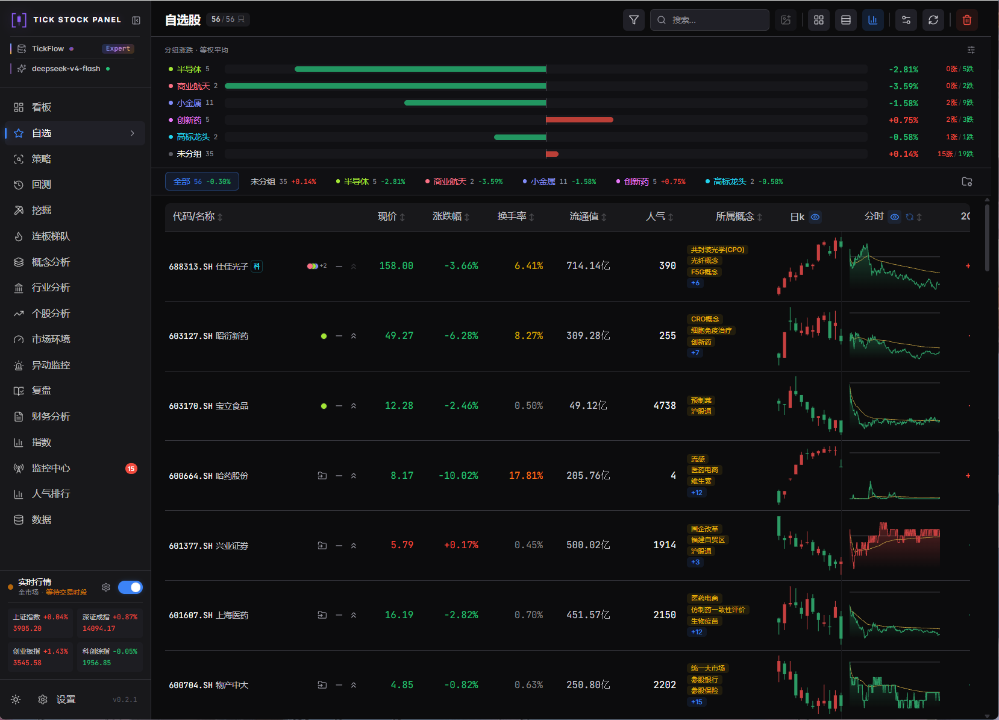

<div align="center">

# 📈 多市场智能量化工作台

**A 股 · 港股 · 美股 —— 自托管、零运维的「选股 + 监控 + 回测」量化工作台**

[](https://github.com/shy3130/tickflow-stock-panel)

[](./LICENSE)
[](https://www.python.org/)
[](https://react.dev/)
[](#-本-fork-新增功能多市场扩展)
[](https://tickflow.org/auth/register?ref=V3KDKGXPEA)
[](https://github.com/hzy1522/tickflow-stock-panel/pkgs/container/tickflow-stock-panel)
[](https://github.com/hzy1522/tickflow-stock-panel/actions/workflows/docker.yml)

**[新增功能](#-本-fork-新增功能多市场扩展)** · **[快速开始](#-快速开始)** · **[预构建镜像](#方式-b预构建镜像最快无需编译)** · **[港美股初始化](#-港美股数据初始化)** · **[已知限制](#️-已知限制与市场差异)** · **[致谢与版权](#-致谢与版权)**

</div>

---

## 📌 关于本项目

> **本仓库是一个衍生作品（fork）**，基于 [**shy3130/tickflow-stock-panel**](https://github.com/shy3130/tickflow-stock-panel) 二次开发，原项目以 MIT 协议开源。
>
> **上游项目是纯 A 股工作台；本 fork 的核心贡献是将其扩展为 A 股 / 港股 / 美股多市场工作台。**
>
> 本仓库完整保留了上游的 Git 提交历史与原始版权声明。上游作者的贡献远大于本 fork 的增量部分，如果你觉得这个项目有用，**请优先去给 [上游仓库](https://github.com/shy3130/tickflow-stock-panel) 点个 Star**。
>
> 详细的衍生关系与修改清单见 [NOTICE](./NOTICE)。

以下声明沿用自上游项目，本 fork 原样尊重：

> **本项目个人开源，数据源插件化，可任意接入第三方数据源。仅供学习研究使用，严禁商业用途。**
>
> ⚠️ 小白请绕路，本开源项目谨作为本地量化提供解决思路 Demo，不作为投资软件或看盘软件。
>
> **明确不做**：不对标同花顺 / 通达信，不内置「AI 荐股 / 涨停预测」。

---

## 🆕 本 Fork 新增功能：多市场扩展

上游项目的所有分析能力都是围绕 A 股设计的（涨停板、连板、封单、同花顺概念）。本 fork 引入了一层**市场抽象**，让看板、指数、选股、回测、复盘等模块都能在港股和美股上工作，并针对两地市场「没有涨跌停」这一根本差异重新设计了对应的分析语义。

### 1. 全局市场切换

侧边栏新增 **A股 | 港股 | 美股** 三段式切换器，选择通过 React Context 全局共享并持久化到 localStorage，刷新后保持。切换后看板、指数、市场环境、AI 复盘、强度梯队等页面自动联动取数。

- `frontend/src/lib/market.tsx`（新增 `MarketProvider` / `useMarket()`）、`components/Layout.tsx`

### 2. 市场注册表：交易规则的元数据中心

新增 `backend/app/markets.py`，把各市场的交易规则收敛为一处可查询的元数据：

| 能力 | 说明 | 现状 |
| :--- | :--- | :--- |
| `market_of(symbol)` | 按后缀解析市场（`.SH/.SZ/.BJ`→cn、`.HK`→hk、`.US`→us） | ✅ 已接入 |
| `get_market` / `ALL_MARKETS` | 取市场元数据、遍历全部市场 | ✅ 已接入 |
| `stamp_tax_for` / `stamp_tax_double_sided` | 印花税率与是否双边收取 | ✅ 已接入回测费率 |
| `normalize_symbol` | 代码归一化（`hk00700`→`00700.HK`、`AAPL`→`AAPL.US`、`920344`→`920344.BJ`） | ⚠️ 暂无调用方 |
| `market_limit_pct` | 委托 `app/price_limits.py` 返回涨跌幅上限，港美股恒为 `None`（无涨跌停） | ⚠️ 暂无调用方 |
| `lot_size_for` / `is_trading_now` / `exchanges_for` | 最小交易单位、北京时间交易时段判断、交易所列表 | ⚠️ 暂无调用方 |

此外还包含 T+N 交收、价格精度等元数据。

> **关于"暂无调用方"**：注册表定义了完整的交易规则元数据，但目前只有
> `market_of`、`get_market`、`ALL_MARKETS` 和印花税三项被业务代码真正读取，
> 其余仍是为后续接入预留的脚手架。这里不写成"所有规则的单一事实来源"，
> 因为那还不是事实。已完成的收口有两处：
> 1. **回测印花税** —— `api/backtest.py::_market_default_fees` 委托注册表而非
>    重复硬编码，测试锁住"改注册表必须传导到回测"；
> 2. **涨跌幅上限** —— 反向收口，`market_limit_pct` 委托 `app/price_limits.py`
>    （它才是指标流水线/回测/API 共用的单一事实源），删掉了注册表里那份与之
>    矛盾的平行实现，测试逐例断言两者换算后完全一致。


### 3. 港美股数据同步

数据页新增 **「港股同步」「美股同步」** 按钮，触发 `POST /api/pipeline/run-market`，复用 A 股管道的任务槽与进度轮询。流程为：按市场过滤标的 → 批量拉取日 K（前复权）→ 计算 enriched 指标表落盘。

- 港美股使用 SDK 的 `adjust="forward"` 一步前复权（两地无独立除权因子表），A 股仍走原有 `adj_factor` 自行复权路径
- 存储按市场分目录：`kline_daily_{hk,us}`、`kline_daily_enriched_{hk,us}`，**A 股原有目录名保持不变，旧数据无需迁移**
- `backend/app/jobs/daily_pipeline.py`、`services/instrument_sync.py`、`services/kline_sync.py`、`indicators/pipeline.py`

### 4. 港美股主要指数

新增 `/api/indices/market` 路由族与独立的指数同步服务，完整复用 A 股指数页 UI：

- **港股**：恒生指数、恒生科技、恒生国企、红筹指数、创业板 GEM、恒生综合
- **美股**：标普 500、纳斯达克、道琼斯、纳斯达克 100、VIX
- 数据取自腾讯 / 东方财富公开免费行情接口，多级兜底（腾讯 `fqkline` → `newfqkline` → 东财 K 线重试 → 实时快照）
- `backend/app/api/indices_market.py`、`services/index_sync_market.py`（均为新增）

### 5. 强度梯队：港美股版「连板梯队」

港美股没有涨停板，因此原「连板梯队」页在港美股模式下切换为语义等价的 **「强度梯队」**：

| A 股语义 | 港美股替代语义 |
| :--- | :--- |
| 连板层级（1板/2板/3板…） | 20 日动量档位（≥3% / ≥8% / ≥15% / ≥25%） |
| 涨停 / 炸板 / 断板 | 新高 / 动量 / 放量 |
| 涨停数 / 跌停数 | 60 日新高数 / 新低数 |
| 板块过滤 | 港股支持主板 / GEM |

页面 UI 与交互完全复用，由 `GET /api/screener/limit-ladder?market=hk|us` 提供数据（新高/动量/放量语义已并入梯队返回，不再维护独立的 `/strength` 端点，避免两份口径相近的实现漂移）。

### 6. 港美股市场环境（Regime）

市场环境页对港美股可用：以 **「动量」子维度替代 A 股「投机」**，60 日新高/新低替代涨停/跌停，指数涨跌以全市场平均涨幅代理。时序独立持久化到 `data/regime_{hk,us}/`，`/api/regime/*` 全部端点支持 `market` 参数。

### 7. 港美股市场总览（看板）

看板对港美股可用：涨跌家数、平均涨跌、60 日新高/新低、MA20/MA60 上方占比、四维情绪雷达（赚钱 / 量能 / 动量 / 抗跌）、领涨领跌榜。

### 8. 港美股 AI 复盘

复盘页对港美股可用，配备**专用 system prompt**（禁用涨停/连板/封单等 A 股术语，改以新高/新低/动量/放量表述），NDJSON 流式协议与 A 股一致，历史报告按市场隔离。另提供不依赖 AI 的 `GET /api/market-recap/market-data` 数据版复盘。

### 9. 港美股选股

选股页支持切换市场。关键设计是**策略兼容性门控**：依赖 `signal_limit_up` / `signal_broken_limit_up` 等涨停类信号的策略在港美股下被自动过滤并给出明确提示，避免产生无意义的空结果。成交额、换手率、板块等字段在数据缺失时自动跳过过滤而非误杀全部标的。

### 10. 港美股策略回测

回测页新增市场选择器，并按市场应用正确的交易成本：

| 市场 | 印花税 |
| :--- | :--- |
| A 股 | 卖出单边 0.05% |
| 港股 | **双边各 0.1%**（新增 `stamp_tax_double_sided` 配置项支持买入腿计税） |
| 美股 | 无 |

数据面板按市场路由到独立 enriched 目录，矩阵磁盘缓存按市场隔离（`.backtest_matrix_cache_{market}`）；港美股无涨跌停列，涨跌停买卖拦截自动不生效。

### 11. 个股关键价位支持港美股

`/api/stock-analysis/levels` 与个股分析按 symbol 后缀自动解析市场并读取对应日 K 目录。

<details>
<summary><b>🔧 向后兼容性设计（点击展开）</b></summary>

多市场改造的前提是**不破坏任何现有 A 股行为**：

- 所有后端接口的 `market` 参数默认 `"cn"`，A 股请求路径与返回格式完全不变
- A 股存储目录名保持不变（`kline_daily` / `kline_daily_enriched`），旧数据零迁移
- 缓存全部按市场隔离：总览缓存 key、市场环境缓存 key、回测 PanelCache key、矩阵磁盘缓存目录，避免跨市场串数据
- 新增 DuckDB 视图为增量注册，不影响既有视图
- 指标流水线在港美股下补 0 保持存储列契约，下游读取逻辑无需分支

</details>

---

## ⚠️ 已知限制与市场差异

诚实说明港美股相比 A 股的能力缺口，避免误用：

| 限制 | 原因 |
| :--- | :--- |
| 港美股**无成交额数据**（恒为 0） | 数据源 SDK 不提供，相关过滤器自动跳过 |
| 港美股**无概念 / 行业轮动分析** | 同花顺概念与行业分类为 A 股专属数据源，概念/行业分析页在港美股下显示不支持提示并提供一键切回 A 股 |
| 港美股**无分时数据** | 免费行情源不提供，`/minute` 端点恒返回空 |
| 美股指数历史可能仅有快照 | 免费源无历史时以实时快照兜底，接口会标记 `snapshot: true` |
| 依赖涨停/连板的内置策略在港美股不可用 | 两地市场无涨跌停机制，已做策略门控 |
| 港美股无独立除权因子表 | 改用数据源前复权，复权精度依赖上游 |

**待改进（欢迎 PR）**：

- 选股页与策略回测页的市场选择现已**跟随侧边栏全局切换器**（2026-08 修复，含后端 `run_all` 尊重 `market`、策略结果缓存按市场隔离）
- `GET /api/market-recap/market-data` 已接入复盘页：港美股 AI 复盘失败时可一键改用「数据版复盘」（纯模板、不依赖 AI 接口）
- 重复实现已收敛（2026-08）：`GET /api/screener/strength` 删除 —— 其语义（新高/动量/放量）与 `/limit-ladder?market=hk|us` 同源，后者已接入连板梯队页，保留两份实现只会让口径漂移
- `api.ts` 中 `regimeMarket()` 与概念/行业页的内联"市场不支持"提示已清理（2026-08），统一使用 `MarketNotSupportedHint` 组件
- 市场注册表的两处口径不一致已修复（2026-08）：`market_limit_pct` 改为委托 `app/price_limits.py`（全仓库涨跌停单一事实源，ST 仅压主板且含时间切换），`normalize_symbol` 补上北交所 `920/8/4` 号段判定（此前 `920344` 会被错配成 `.SH`）
- **本 fork 落后上游约 67 个提交**（上游 `v0.2.1`，本地 `v0.1.88`），其中包含数据正确性修复（停机缺口检测、僵死 enriched 标记、回测市场环境过滤未生效等），建议同步后再做二次开发

---

## ✨ 继承自上游的核心功能

以下能力全部来自上游项目，本 fork 未改变其设计：

| 模块 | 一句话 | 详见 |
| :--- | :--- | :--- |
| 🔍 **选股引擎** | 18 个内置策略 + 自定义信号 + AI 生成 + 代码迁移，Polars 毫秒级扫全 A 股 | [strategy.md](./docs/strategy.md) |
| 📊 **指标流水线** | MA/EMA/MACD/RSI/KDJ/布林/量比等，一次扫表落盘 enriched Parquet | [features.md](./docs/features.md) |
| 🧪 **回测引擎** | 三种模式（个股/策略组合/自由信号），T+1/手续费/滑点/止损，SSE 流式进度 | [features.md](./docs/features.md) |
| ⛏️ **因子挖掘** | 嵌套样本外搜索多因子排名组合，候选库显式发布、永不自动上线 | [mining.md](./docs/mining.md) |
| 🌡️ **市场环境** | 情绪周期 6 阶段（连板梯队驱动）+ 概念/行业主线排名，与 5 档环境分并存 | [market-phase.md](./docs/market-phase.md) |
| 🚨 **异动监控** | 交易所异动规则口径（3/10/30 日偏离值），盘中实时接近度与推送 | — |
| 📡 **监控中心** | 四类监控（策略/个股信号/价格/异动），多条件 AND/OR + 语音播报 + 飞书推送 | [features.md](./docs/features.md) |
| 📈 **个股分析** | 9 类关键价位 + AI 四维分析（技术/基本面/财务/消息面） | [features.md](./docs/features.md) |
| 🏆 **连板梯队** | 连板层级统计 + 概念涨幅轮动 + 盘后 AI 复盘 + 炸板/翘板预警 | [features.md](./docs/features.md) |
| 🧰 **数据扩展** | 数据源插件化（stock-sdk 示例 + YAML 自定义源），扩展字段配成一级页面 | [custom-data-source.md](./docs/custom-data-source.md) |

<details>
<summary><b>📦 主要页面一览</b></summary>

**📊 行情总览**
- **看板** Dashboard — 市场情绪评分 + 涨跌/成交额榜单 + 概念领涨领跌 + 大盘异动事件流
- **自选** Watchlist — 自选股池，表格/卡片双视图，换手/量比/RSI 等实时指标
- **指数** Indices — 指数浏览与同步（本 fork 扩展支持港美股指数）

**🔍 选股与回测**
- **策略** Screener — Polars 毫秒级扫描，18 个内置策略卡片 + 自定义条件
- **回测** Backtest — 因子回测（IC/IR、分层收益、多空组合）与策略回测（净值、回撤、夏普、胜率）
- **挖掘** Mining — 嵌套样本外因子与策略挖掘，候选入库后显式确认才发布

**📈 个股与板块分析**
- **个股分析** Stock Analysis (Beta) — 日 K + 9 类关键价位 + AI 四维分析
- **财务分析** Financials — 利润表/资负表/现金流/关键指标 + AI 解读
- **概念分析** Concept Analysis — ths 概念涨幅轮动矩阵 + 领涨/领跌主线 + 个股穿透
- **行业分析** Industry Analysis — 行业分层涨幅轮动 + 领涨/领跌主线 + 成分股
- **连板梯队** Limit Up Ladder — 连板层级统计 + 封单监控（本 fork 在港美股下切换为强度梯队）

**🔔 监控与复盘**
- **监控中心** Monitor — 四类规则，盘中实时弹窗 + 语音播报 + 触发记录持久化
- **异动监控** Abnormal Moves — 按交易所异动规则口径实时计算偏离值接近度，盯住异动边缘名单
- **市场环境** Regime — 情绪周期 6 阶段 + 概念/行业主线排名（本 fork 扩展支持港美股）
- **复盘** Review (Beta) — 盘后 AI 自动生成市场复盘，可定时执行、推送飞书、下载 Markdown

**🗄️ 数据与扩展**
- **数据** Data — 本地数据画像与同步状态，盘后管道与历史扩展（本 fork 新增港美股同步入口）
- **扩展分析**（动态菜单）— 把任意第三方数据字段配成一级菜单
- **设置** Settings — TickFlow Key、AI 接口、实时监控、扩展页面、信号库、系统设置

</details>

---

## 📸 界面预览

> 截图来自上游项目的 A 股界面，港美股模式复用同一套 UI。

<table>
  <tr>
    <td width="50%" align="center"><b>看板 Dashboard</b></td>
    <td width="50%" align="center"><b>策略 Screener</b></td>
  </tr>
  <tr>
    <td width="50%"></td>
    <td width="50%"></td>
  </tr>
  <tr>
    <td width="50%" align="center"><b>回测 Backtest</b></td>
    <td width="50%" align="center"><b>挖掘 Mining</b></td>
  </tr>
  <tr>
    <td width="50%"></td>
    <td width="50%"></td>
  </tr>
  <tr>
    <td width="50%" align="center"><b>监控中心 Monitor</b></td>
    <td width="50%" align="center"><b>连板梯队 Limit Ladder</b></td>
  </tr>
  <tr>
    <td width="50%"></td>
    <td width="50%"></td>
  </tr>
  <tr>
    <td width="50%" align="center"><b>概念分析 Concept</b></td>
    <td width="50%" align="center"><b>自选 Watchlist</b></td>
  </tr>
  <tr>
    <td width="50%"></td>
    <td width="50%"></td>
  </tr>
</table>

<div align="center">

### 📸 [查看更多界面截图 »](./screenshots/README.md)

</div>

---

## 🚀 快速开始

> 前置依赖：Python ≥ 3.11 · Node ≥ 20 · [`uv`](https://docs.astral.sh/uv/) · `pnpm`（`npm i -g pnpm`）
>
> 👉 **只想跑起来看看？走 [方式 B](#方式-b预构建镜像最快无需编译) —— 只需要 Docker，上述依赖一个都不用装。**

### 方式 A：Dev 模式（二次开发推荐）

```bash
cp .env.example .env       # 按需填 TICKFLOW_API_KEY(留空 = None 模式)
./dev.sh                   # Windows: .\dev.ps1
```

自动检查 / 下载依赖、释放端口、同时起前后端。后端 → <http://localhost:3018> · 前端 → <http://localhost:3011>。

### 方式 B：预构建镜像（最快，无需编译）

本 fork 的 CI 自动构建多架构镜像并发布到 GHCR，支持 `linux/amd64` 与 `linux/arm64`（含 Apple Silicon），**无需克隆仓库、无需本地编译**：

```bash
mkdir -p data
docker run -d --name tickflow \
  -p 3018:3018 \
  -e DATA_DIR=/app/data \
  -v "$PWD/data:/app/data" \
  ghcr.io/hzy1522/tickflow-stock-panel:latest
# 打开 http://localhost:3018
```

上面的命令不带任何配置即可启动（等同 **None 模式**，历史日 K 免费可用）。需要填 TickFlow Key / AI 接口时，两种方式任选：

- **推荐**：直接在面板的 **设置** 页填写并保存，无需重启容器
- 或准备一个 `.env` 后重新 `run`，在原命令上追加 `--env-file .env`（配置项说明见 [docs/configuration.md](./docs/configuration.md)）

> ⚠️ **关于 `-e DATA_DIR=/app/data`**：镜像本身已内置该默认值，裸跑时可省略。但一旦你追加 `--env-file .env`，`.env` 里开发模式用的 `DATA_DIR=./data` 会覆盖镜像默认值，导致数据写进容器内未挂载的目录、**重建容器即丢失**。`-e` 的优先级高于 `--env-file`，因此保留这一行可以一劳永逸地防住这个坑（`docker-compose.yml` 里做的是同一件事）。
>
> 想锁定版本可用 commit sha 标签替代 `latest`，例如 `ghcr.io/hzy1522/tickflow-stock-panel:212afd8`。
>
> 用 Compose 跑预构建镜像：把 `docker-compose.yml` 里的 `build:` 段换成 `image: ghcr.io/hzy1522/tickflow-stock-panel:latest` 即可复用其余配置（端口、卷、重启策略）。

### 方式 C：Docker 本地构建

```bash
cp .env.example .env
docker compose up --build
# 打开 http://localhost:3018
```

镜像已内置 **stock-sdk** 数据源插件（Node 运行时 + 依赖），开箱即用。

> 📖 Docker 进阶、GitHub Actions 自构建、老 CPU 兼容、访问密码设置等见 [docs/deployment.md](./docs/deployment.md)。

### 第一次使用（A 股）

1. **设置 → 凭据与能力** → 点 **重新检测**，确认档位标签
2. **设置** → **立即跑盘后管道**：拉日 K + 计算 enriched 表（None / Free 走 free-api，当日数据盘后 1-2 小时可用）
3. **自选**页加标的 → **选股**页点策略卡片扫描 / 配自定义信号
4. **回测**页选策略 + 区间 → 看净值 / 夏普 / 交易明细（SSE 实时进度）
5. **监控中心**配规则，盘中实时弹窗 + 持久化记录

---

## 🌏 港美股数据初始化

港美股数据需单独同步一次（本 fork 新增流程）：

1. 打开 **数据** 页
2. 点击 **「港股同步」** 或 **「美股同步」**
3. 等待任务完成 —— 免费模式下港股约 10 分钟、美股约 30-40 分钟（首次全量）
4. 用侧边栏 **市场切换器** 切到港股 / 美股，看板、指数、强度梯队、市场环境等页面即可使用

> **注意**：选股页与策略回测页需在**页内单独选择市场**（见 [已知限制](#️-已知限制与市场差异)）。
>
> 指数数据可在 **指数** 页手动点击同步。

---

## ⚙️ 配置

所有配置从根目录 `.env` 读取（复制 `.env.example` 开始），也可在面板 **设置** 页修改。最常用的三项：

```ini
TICKFLOW_API_KEY=              # 留空 = None 模式(历史日K免费);填 Key 解锁更多
AI_API_KEY=                    # 留空 = 关闭 AI;填 Key 启用策略生成
PORT=3018                      # 服务端口
```

> 📖 完整配置项见 [docs/configuration.md](./docs/configuration.md)。

---

## 🏗️ 技术栈

| 层           | 选型                                                                                              |
| :----------- | :------------------------------------------------------------------------------------------------ |
| **后端**     | FastAPI · Pydantic v2 · APScheduler · sse-starlette                                               |
| **数据**     | Polars(计算)· DuckDB(查询)· Parquet(存储)                                                         |
| **回测**     | vectorbt(全项目唯一 pandas 边界)                                                                  |
| **数据源**   | [TickFlow](https://tickflow.org/auth/register?ref=V3KDKGXPEA) 官方 SDK · 插件化扩展(stock-sdk 示例插件 · YAML 自定义源) · 港美股指数走腾讯/东财公开免费接口 |
| **AI**(可选) | OpenAI 兼容接口(DeepSeek / 通义 / Ollama 等)                                                      |
| **前端**     | React 18 · Vite · TypeScript · Tailwind · Tanstack Query · Lightweight Charts · ECharts · dnd-kit |
| **部署**     | Docker 两阶段构建,前端 dist 拷进后端镜像,**单容器**                                               |

---

## 🗺️ 路线图

| Phase  | 内容                                                               | 状态 |
| :----- | :----------------------------------------------------------------- | :--- |
| 0-1    | 仓库骨架 · FastAPI 壳 · 能力探测 · K 线同步与分析页                | ✅    |
| 2-3    | Polars enriched 流水线 · Screener · vectorbt 回测(T+1/手续费/止损) | ✅    |
| 4-5    | 监控引擎 · 四类监控规则 · 实时 SSE 推送 · 持久化记录               | ✅    |
| 6      | 个股分析(专用日 K + 9 类关键价位 + AI 四维分析)                    | ✅    |
| **v0.2** | 因子挖掘全链路 · 市场阶段与主线识别 · 异动监控 · 数据源插件化     | ✅    |
| **v2** | Webhook 推送· 板块异动 · 早晚报 · 更多扩展           | 🚧    |
| **本 fork** | 多市场扩展(A股 / 港股 / 美股)                                 | ✅    |

---

## 📚 完整文档

| 文档                                                                                               | 内容                                                                 |
| :------------------------------------------------------------------------------------------------- | :------------------------------------------------------------------- |
| [NOTICE](./NOTICE)                                                                                 | **衍生关系、上游归属与修改清单**                                     |
| [docs/deployment.md](./docs/deployment.md)                                                         | 部署方式(Dev / Docker / GH Actions)、老 CPU 兼容、更新代码、访问密码 |
| [docs/configuration.md](./docs/configuration.md)                                                   | 所有 `.env` 配置项详解(数据源、AI、服务、密码、数据目录)             |
| [docs/features.md](./docs/features.md)                                                             | 各功能模块详细说明(选股/指标/回测/监控/个股分析/数据扩展)            |
| [docs/custom-data-source.md](./docs/custom-data-source.md)                                         | 自定义数据源接入、YAML 配置与 mock 联调示例                         |
| [docs/strategy.md](./docs/strategy.md)                                                             | 策略体系(18 内置策略 + 三种扩展方式 + 文件结构)                      |
| [docs/mining.md](./docs/mining.md)                                                                 | 因子与策略挖掘口径、防泄漏、任务隔离和发布边界                       |
| [docs/market-phase.md](./docs/market-phase.md)                                                     | 市场情绪周期 6 阶段与概念/行业主线识别的口径与设计                   |
| [docs/plugin-development.md](./docs/plugin-development.md)                                         | 数据源插件开发规范(以 stock-sdk 为参考实现)                         |
| [docs/secondary-development.md](./docs/secondary-development.md)                                   | 代码二次开发、前端插槽、后端策略接口与 AI 开发模板                   |
| [docs/upstream-merge.md](./docs/upstream-merge.md)                                                 | 合并上游操作手册（冲突解决模式 · 验证矩阵 · 常见坑）               |
| [CONTRIBUTING.md](./CONTRIBUTING.md)                                                               | 项目架构、数据契约、缓存与性能要求、测试矩阵                         |
| [backend/app/strategy/prompts/strategy-guide.md](./backend/app/strategy/prompts/strategy-guide.md) | 策略开发完整规范(AI 生成与手写)                                      |

---

## 🙏 致谢与版权

### 上游项目

本项目基于 [**shy3130/tickflow-stock-panel**](https://github.com/shy3130/tickflow-stock-panel) 二次开发。上游项目构建了完整的量化工作台架构 —— 指标流水线、选股引擎、回测引擎、监控中心、AI 分析 —— 本 fork 仅在其之上增加了多市场支持。

**衷心感谢原作者 [@shy3130](https://github.com/shy3130) 及所有上游贡献者。** 请优先为上游项目点 Star。

- **上游 Issue / 讨论**：请前往 [上游仓库](https://github.com/shy3130/tickflow-stock-panel/issues)
- **本 fork 多市场功能的问题**：请在本仓库提 Issue

### License

本项目以 [MIT](./LICENSE) 协议开源，与上游保持一致。

```
Copyright (c) 2026 tickflow-stock-panel contributors   # 上游原始版权，完整保留
Copyright (c) 2026 hzy1522                             # 本 fork 修改部分
```

上游的原始版权声明已完整保留于 [LICENSE](./LICENSE)，未作删除或改写。衍生关系与第三方声明详见 [NOTICE](./NOTICE)。

### 第三方声明

- 本项目依赖 [TickFlow](https://tickflow.org) 提供数据服务，使用前请遵守其服务条款。**本项目非 TickFlow 官方项目。**
- 数据源插件 [stock-sdk](https://stock-sdk.linkdiary.cn) 遵循其各自的 ISC 协议。
- 本 fork 新增的港美股指数数据取自腾讯、东方财富公开免费接口，仅用于个人学习研究，使用者需自行遵守相应服务条款。
- 上游项目基于智谱 GLM 大模型能力构建，并已链接认可 [LINUX DO 社区](https://linux.do)。

---

## ⚠️ 免责声明

本项目仅供**学习与量化研究**，**不构成任何投资建议**。回测结果不代表未来收益。证券市场有风险，入市需谨慎。数据准确性以各数据源官方为准。

港美股功能使用公开免费行情接口，数据可能存在延迟、缺失或不准确，**请勿用于实盘决策**。
